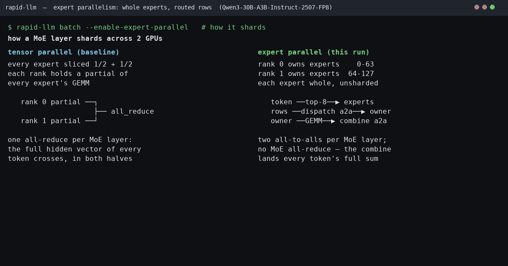

# 专家并行

专家并行（EP）把 MoE 的完整专家分到多个 rank，而不是把每个专家的矩阵继续切片。它减少单 rank 的专家权重和尺度张量；代价是每层需要两次 all-to-all。

## 使用

EP 复用 TP 进程组。专家数必须能被 `tensor_parallel_size` 整除。

```python
from rapid_llm import ContinuousBatchingEngine

engine = ContinuousBatchingEngine.from_pretrained(
    "my_weight/DeepSeek-V2-Lite",
    tensor_parallel_size=2,
    enable_expert_parallel=True,
)
```

CPU 调试时增加 `device="cpu"`，通信后端改为 Gloo。直接构造 `LLM` 不会创建多 rank 进程组；多卡入口应使用 `ContinuousBatchingEngine.from_pretrained` 或 `DataParallelEngine`。

## 数据流（五阶段流水线）

MoE 模块镜像 sglang `srt/layers/moe/` 的分层：单文件 `moe.py` 已拆成 `modules/moe/` 包，三层解耦 + 插件化注册表，`SparseMoeBlock`（rapid_llm 的 `FusedMoE` 对应物）把五个阶段串起来：

- **router.py**（阶段 1 Route）：`TopKRouter.forward(x, gate_weight) -> TopKOutput`，5-tier router GEMM + greedy / grouped(`noaux_tc`/`group_limited_greedy`) top-k。
- **token_dispatcher/**（阶段 2 & 5 Dispatch/Combine）：`BaseDispatcher` ABC + `@register_dispatcher(MoeA2ABackend)` 注册表。非 EP 走 `StandardDispatcher`（直通，all-reduce 仍留在 layer），a2a EP 走 `AllToAllDispatcher`（两次 all-to-all；保留 `dispatch_a/b` + `combine_a/b` 两段式给 TBO 交错）。
- **moe_runner/**（阶段 3-4 Permute + Expert-GEMM）：`MoeRunner` 按 `(a2a_backend, runner_backend)` 键查 fused-func 快路径，否则走 pre-permute → core → post-permute；rapid_llm 注册 `FusedMoERunnerCore`（Triton grouped GEMM）+ 恒等 permute。
- **layer.py**：`SparseMoeBlock` 编排 `route → dispatch → run → combine → finalize`（finalize = routed scaling / 共享专家 / deferred-AR fence / 非 EP 分支的 TP all-reduce）。7 个 `op_*`（TBO 用）与 `MoEOpContext` 保持原签名，内部改调三层 seam。

五阶段的运行时语义（EP 路径）：

1. Router 在每个 rank 上为本地 token 选择全局 expert id 和权重。
2. Dispatch 按 expert 所属 rank 稳定排序，再用 all-to-all 发送 token 和 id。
3-4. 接收端把全局 id 转为本地 id，只运行本 rank 的专家（grouped GEMM）。
5. Combine 用第二次 all-to-all 把结果送回来源 rank，并在来源端恢复顺序、应用 router 权重。

**诚实标注架构开销**：rapid_llm 只有 1 个 a2a dispatch 后端 + 1 个 Triton runner，两个枚举（`MoeA2ABackend`/`MoeRunnerBackend`）与注册表多为单条目，permute pool 注册的是恒等函数——它们是对齐 sglang DeepEP/pplx/nixl 多后端结构留的**扩展位**，不是当前在用的机制。这层分层是为可读性与可扩展性付的一点结构性开销，**不改变数值，也不改变 EP 性能**（下方实测：重构后 ep/tp 比值与重构前、与 vLLM 均落在同一区间）。

每个目的 rank 的缓冲区默认按最坏路由（`top_k × ep_size` 份）预留：固定形状避免先交换计数，也能进入 CUDA Graph，极端不均衡也不溢出。**填充行携带 `-1` 专家 id**，`_moe_align_count_kernel` 有范围守卫直接跳过 `[0, num_experts)` 之外的 id——它们跨线但绝不进入 grouped GEMM，combine 时读回零；这修掉了填充行白算专家 GEMM 的浪费（microbench：rows=2048 时 padded 973µs vs exact 374µs，2.60x）。

参考 sglang `srt/layers/moe` 的 DeepEP 容量策略，dispatch 还提供一个**可选**的容量上限：设 `RAPID_EP_CAPACITY_FACTOR` 后，每 rank 容量收成 `min(n, ceil(n/ep_size × factor) + slack)`（均值+松弛），溢出行落进一个多分配的 trash slot（交换前切掉，静态形状保持 graph 可捕获），eager 下由设备端检测报错或 `RAPID_EP_CAPACITY_WARN=1` 警告。默认**不启用**（`cap == n`，无丢弃无崩溃，只保留上面的 `-1` GEMM 收益）：ep=2 真实路由偏斜大（实测热层达 1.58x 均值，factor=1.25 会丢 16% token），削减不安全；收益随 ep_size 增大（均值为 `n/ep_size`），高 EP 度才值得开。

共享专家不参与 EP 切分。启用 SBO 时，共享专家计算可以和 routed expert 的 dispatch 重叠；TBO 则在两个 micro-batch 间交错计算和通信。两种路径都必须让所有 rank 以相同顺序提交 collective，否则会错配或挂起。

## 量化与设备

EP 权重加载器只保留当前 rank 的连续专家区间。普通、FP8、INT8、SmoothQuant、AWQ、GPTQ 和 MXFP4 的专家权重及 scale/zero 张量都按本地专家数分配。计算时先把全局路由 id 转为本地 id，再调用对应量化 MoE 方法；不能绕过 quant method 直接进入普通 `fused_moe`。

GPU 使用 NCCL 和 fused grouped GEMM。CUDA Graph 捕获包含 EP collective，所有 rank 必须使用相同的 graph 策略和 shape。CPU 使用 Gloo 与 PyTorch MoE，可验证路由、权重分片和数值，但不代表 GPU 通信或 kernel 性能。

## 验证

不需要 checkpoint 的 CPU 回归：

```bash
.venv/bin/python -m pytest tests/distributed/test_ep_moe.py tests/modules/test_ep_dispatch.py -q --no-cov
```

它覆盖两 rank dispatch/combine、完整 MoE 前向、量化数值、所有已注册专家权重布局，以及非法路由输入。双 GPU 环境会额外执行 NCCL fused-MoE 与 EP+TBO 数值测试。

双 GPU 上还有一道真实引擎门禁（`tests/distributed/test_ep_engine.py`）：同一 checkpoint 起 tp2 / ep2 / ep2_tbo / ep2_graph 四个真实两 rank 引擎，要求 EP 的 fork 只落在基线自己 margin（≤ 0.5 nat tie-gap）容许的步骤上——EP 重排 MoE 归约，只能翻转算术上未定的 token：

```bash
RAPID_LLM_TEST_DSV2_DIR=/mnt/otto-temp/modelzoo_with_full_weights/Qwen3-30B-A3B-Instruct-2507-FP8 \
    .venv/bin/python -m pytest tests/distributed/test_ep_engine.py -q
# 5 passed（Qwen3-30B-A3B-Instruct-2507-FP8，2× H100）
```

CUDA Graph、SBO、TBO 和性能结论仍需在目标 GPU、驱动与互联上实测；CPU 或静态检查不能替代这一步——下一节就是一次这样的实测。

## 实测数据

Qwen3-30B-A3B-Instruct-2507-FP8（48 层 × 128 专家 × top-8，专家宽 768），2× H100 80GB（NV18 NVLink），greedy，**离线批处理**（所有 prompt 一次性提交，无服务队列）。五条臂各在独立进程里跑同一引擎，只差三个开关；五组场景扫 batch（1/16/64）× prompt 长度（短/2k/32k），生成均 128 tok，prompt 实测长度随表披露：

| 臂 | 含义 |
| --- | --- |
| tp1 | 单卡 + CUDA Graph：无通信的参照上限 |
| tp2 / ep2 | 两卡 TP / EP，均 eager |
| tp2_graph / ep2_graph | 两卡 TP / EP，均开 CUDA Graph（EP 对 TP 的公平对比项） |

**先修正本页早期版本的一个错误结论**：当时 ep2_graph 对 *eager* tp2 报了 4.53x，但那是 CUDA Graph 对 eager 的差异，不是 EP 对 TP 的。同开 graph 后（下表倒数第二列），EP 在这台机器的这个模型上**每个场景都更慢**：

| 场景 | batch | prompt tok | tp1 | tp2 | tp2_graph | ep2 | ep2_graph | ep2_graph/tp2_graph | tp2_graph/tp1 |
| --- | ---: | ---: | ---: | ---: | ---: | ---: | ---: | ---: | ---: |
| bs1-short | 1 | 24 | 145.9 | 13.2 | 116.6 | 9.0 | 75.6 | 0.65x | 0.80x |
| bs16-short | 16 | 11-24 | 1300.6 | 206.1 | 1271.5 | 134.1 | 913.9 | 0.72x | 0.98x |
| bs64-short | 64 | 11-24 | 3795.7 | 826.8 | 4275.0 | 555.0 | 2497.7 | 0.58x | 1.13x |
| bs16-2k | 16 | 2048 | 634.3 | 174.6 | 741.2 | 118.1 | 405.0 | 0.55x | 1.17x |
| bs4-32k | 4 | 32768 | 20.6 | 25.5 | 25.3 | 15.9 | 15.7 | 0.62x | 1.23x |

（tok/s；TPOT 见 JSON：bs16-short 下 tp2_graph 12.12ms、ep2_graph 16.76ms。）

### 为什么这个模型在这里开 EP 更慢

这台机器、这个模型上，EP 的三个理论收益一个都不兑现，成本却全数到位：

- **权重没有省**。TP 是每专家切半宽 × 128 个，EP 是 64 个整专家——每 rank 字节数完全相同（两卡臂峰值显存都在 16-19 GiB）。EP 的内存收益出现在专家权重单卡放不下、要更多 rank 分摊时；2 rank 纯 EP 对纯 TP 没有这一项。
- **小专家没有 GEMM 效率差**。专家宽 768 的 grouped GEMM 在 decode 时是权重带宽瓶颈：TP 半宽与 EP 全宽每 rank 读的总字节数相同，切与不切都不改变带宽利用。EP 的 GEMM 收益需要大专家、大 batch（每专家分到足够多的行）。
- **NVLink 上没有通信字节优势**。a2a 每字节只跨一次，all-reduce 环形近似跨两次——这是 EP 在慢互联上的经典卖点；900 GB/s 的 NV18 上两边都是延迟主导，省一半字节不省时间。
- **成本是结构性的**：每层 2 次 a2a（TP 的 MoE all-reduce 是 1 次），容量预留使线上字节约为 all-reduce 的 top_k 倍——bs16-short 实测 13940 MiB vs 915 MiB（15×），bs4-32k 772 GiB vs 49 GiB（16×）；再加 dispatch 的 sort/searchsorted/scatter 排列 kernel。graph 把 launch 开销消掉了，剩下的通信与排列时间就是 TPOT 16.76 vs 12.12ms 的差。
- **eager 下更糟**（ep2/tp2 = 0.62-0.68x）：每层两次集合通信的 Python 发射成本裸露。早期单点 run 里 TBO 同理是负优化（0.35x）：它为慢互联设计。

顺带一读：**TP 自己也要到大 batch / 长上下文才回本**（tp2_graph/tp1 从 bs1 的 0.80x 到 32k 的 1.23x）——decode 通信延迟对小 batch 是净损失，prefill 计算分半才在大上下文兑现。

### 跨框架对照：vLLM 也是 EP < TP

为排除"是不是 rapid_llm 实现有缺陷"，在同一台机器、同一份 Qwen3-30B-A3B-Instruct-2507-FP8 上用 **vLLM 0.28**（成熟框架）跑同样的对照：`tensor_parallel_size=2` 固定，只翻 `enable_expert_parallel`，两臂都开 CUDA Graph（`enforce_eager=False`），短 prompt + `ignore_eos` 让计时窗口以 decode 为主。一进程一臂，互不污染。

| 场景 | batch | out tok | vLLM tp2 | vLLM ep2 | ep2/tp2 |
| --- | ---: | ---: | ---: | ---: | ---: |
| bs16-short | 16 | 256 | 3294.9 | 1904.0 | 0.58x |
| bs64-short | 64 | 256 | 10734.7 | 6664.8 | 0.62x |
| bs16-2k | 16 | 2048 | 3052.3 | 1802.0 | 0.59x |

（tok/s；绝对值与 rapid_llm 不可比——harness 与 out_len 不同——**可比的是 ep/tp 比值**。）vLLM 的 0.58-0.62x 与 rapid_llm 同开 graph 的 0.55-0.72x 落在同一区间：**ep=2 时 EP 慢于 TP 是这台机器/这个模型的固有性质**（两卡同 NVLink 域、通信延迟主导、EP 的三个理论收益一个都不触发），不是某一框架实现的缺陷。复现脚本 `.qoder/vllm_ep_ab.py`，原始 JSON 在 `.qoder/vllm_ab/`。

### 头对头（同 workload，ep2+graph）：绝对 tok/s 也对得上

上表刻意只比 ep/tp 比值，因为两侧 harness/out_len 不同。这次把 rapid_llm 侧的口径**对齐到 vLLM**——同 prompt、同 batch、同 out_len（256/256/2048）、CUDA graph 开、每条请求都跑满 cap（rapid_llm 无 `ignore_eos`，改为清空 stop-token 集 + `stop_on_repeat=False` 等效），`decode_tps = gen_tokens / wall`（含 prefill，与 vLLM 完全同义）——于是绝对值可以直接对照。复现脚本 `.qoder/rapid_ep_ab.py`（`--arm ep2/tp2`），原始 JSON 在 `.qoder/rapid_ab/`。

| 场景 | batch | out tok | vLLM ep2+graph | rapid_llm ep2+graph | rapid/vLLM | 归因 |
| --- | ---: | ---: | ---: | ---: | ---: | --- |
| bs16-short | 16 | 256 | 1904.0 | 933.6 | 0.49x | 传输栈 |
| bs64-short | 64 | 256 | 6664.8 | 1722.5 | 0.26x | 传输栈 + 排列不摊薄 |
| bs16-2k | 16 | 2048 | 1802.0 | 983.7 | 0.55x | 传输栈 |

绝对值上 rapid_llm ep2 是 vLLM 的 0.26-0.55x。但**这不是 EP 特有的差**：同口径下 rapid_llm tp2 相对 vLLM tp2 也是 0.29-0.49x（1597/3295、3107/10735、1388/3052），tp 与 ep 的框架差几乎一致——说明绝对差距是**整栈成熟度**（融合 grouped GEMM / CUTLASS/DeepGEMM kernel、调度器、传输）的差，不是 EP 结构本身。把 EP 结构单独隔离出来的正是 ep/tp 比值：rapid_llm 本轮 0.58/0.55/0.71x（ep2 933.6/1722.5/983.7 ÷ tp2 1597.2/3106.6/1388.0）与 vLLM 的 0.58/0.62/0.59x 仍落在同一区间，也与**重构前**本页记录的 0.55-0.72x 一致——**架构分层没有动 EP 的数值与性能**。bs64 的 0.26x 是全表最差点：rapid_llm 的独立 sort/searchsorted/scatter + `all_to_all_single` 不像 vLLM 的融合路径那样随 batch 摊薄固定开销，这与上一节列的"传输栈"归因同源。TPOT 佐证同一结论（rapid_llm ep2 16.2-18.2ms vs tp2 9.6-11.5ms，差值即两次 a2a + 排列）。

### 为什么 DeepSeek-V3 这类大 MoE 生产上仍推荐 EP

本页的负结果**不能**外推到生产部署——生产推荐 EP 的前提，本测试一个都没占：

1. **TP 出不了 NVLink 域**。V3/R1 671B 的 FP8 权重约 685 GB，8×H100（640 GB）放不下，最小部署 8×H200 或 2×8×H100 起步，必然跨节点；TP 每层两次 all-reduce 不能跨 IB，专家只能按 EP 分出去。本测试两张卡在同一 NVLink 域内，这条从未被触发。
2. **生产拓扑是 DP-attention + EP，不是纯 EP**。MLA 的压缩 KV（576/层）按 token 共享、无法按注意力头切分，TP 下每个 rank 都要存全批 token 的 KV；DP-attention 把请求分给各 rank（MLA 注意力权重 ~4 GB FP8，复制得起），KV 容量 ×N，还顺手消掉 attention 的 all-reduce。本实现是纯 EP（attention 仍走 TP）——ep2 剩下的 6272 次 all-reduce 就是那一半。
3. **交换按需，不按最坏**。DeepEP 的 dispatch 把每个 token 去重后发给实际命中的 ~E[distinct] 个目的（top-8、ep=8 时约 5.25 份），LL 模式还允许溢出丢弃换紧凑容量；本实现默认容量预留线上恒为 `top_k×ep_size` 份——ep=2 时 16 份 vs 需要 ~2 份，ep=8 时 64 份 vs ~5.25，ep=32 时 256 份 vs ~8。本次重构已落下可选的均值+松弛容量（`RAPID_EP_CAPACITY_FACTOR`）+ 溢出检测，但 ep=2 真实偏斜大（热层 1.58x），factor=1.25 会丢 16% token，故默认关；真正的解法是 DeepEP 那样的**去重发送**（而非单纯缩容量）。**wire 随 rank 数线性变差**：不改这条，规模化也兑现不了 EP 的字节优势。
4. **传输栈**。DeepEP 用 NVSHMEM/RDMA、把排列折进拷贝、单次交换几十 μs；本实现是 NCCL `all_to_all_single` + 独立的 sort/searchsorted/scatter kernel。bs16 下每层 EP 通信路径与 TP 的差值实测 96 μs，而同规模消息在 NVLink 上的线时间 ≈1 μs——差值几乎全是延迟与发射，不是带宽。

结论：rapid_llm 的 EP **正确但 baseline 级**——数值（tie-gap 门禁）、graph 捕获、无损路由都过关；差距是三件事：拓扑配对（DP-attention）、按需交换（去重/动态容量）、融合传输。它们是把 EP 从"扩展维度的正确性路径"变成"性能路径"的先决条件。

### MoE all-reduce 确实没了，但换来的更贵

| 场景 | tp2 all-reduce | ep2 a2a + all-reduce |
| --- | ---: | ---: |
| bs16-short | 915 MiB / 12416 次 | 13940 MiB / 18432 次 a2a + 444 MiB / 6272 次 |
| bs4-32k | 49857 MiB / 18527 次 | 790251 MiB / 27504 次 a2a + 25185 MiB / 9359 次 |

all-reduce 次数减半（只剩 attention 的那一半），代价是字节 ~16× 的 a2a。字节数是 driver rank 记账；graph replay 绕过 Python 记账，graph 臂的字节只含 eager prefill，上表因此用 eager 臂保证可比。

### 长上下文的 graph 边界

CUDA Graph 按 (batch, seq bucket) 捕获，bucket 最大 4096；KV 长度超过最大 bucket 的 decode 自动回落 eager——bs4-32k 的 graph 臂 replays=0、TPOT≈eager 臂（tp2_graph 25.3 ≈ tp2 25.5 tok/s）即由此来。所以 32k 场景的"graph"行实际测的是 eager；两卡在此场景赢单卡靠的是 prefill 计算分半（TTFT 10.0s vs 18.3s），不是 decode。

### 一致性

vs tp2（greedy，6 prompt × 24 tok，tie-gap 0.5 nat）：tp1、ep2、ep2_graph 全部 tie-licensed——真实 fork 都在 step 2，基线自身 margin 0.125 nat；tp1 与 tp2 也会 fork（agreement 75.7%），说明这是浮点重排的固有未定步，不是 EP 引入的错误。tp2_graph 与 tp2 逐字节一致（100%）。

复现（全矩阵约 12 分钟）：

```bash
.venv/bin/python benchmarks/parallelism/bench_expert_parallel.py \
    --model /mnt/otto-temp/modelzoo_with_full_weights/Qwen3-30B-A3B-Instruct-2507-FP8
```

指标口径：per-request（TTFT 取每条请求自身首 token 时刻，TPOT 取 (完成−首 token)/(token 数−1)）——32k prompt 按 512-token chunk 预填充，按 step 间隔算会把首个 chunk 的结束误报成 TTFT。原始数据（环境、五场景全部指标、流量、parity 明细）在 `docs/benchmark_logs/expert_parallel_Qwen3-30B-A3B-Instruct-2507-FP8_20260908_090311.json`；早期单点版本（含 TBO 臂）保留在 `..._20260908_061411.json`。

## 可视化



前两帧是原理：TP 把每个专家切片、每层 MoE all-reduce 全 hidden 向量；EP 把整专家发牌、每层两次 a2a 只送被路由的行，第二帧讲容量交换为何 graph-safe（split 静态、形状固定）。之后是真实 EP2 引擎逐步录制的运行：右上热力图是 128 个专家的逐步路由（左块绿 = rank 0 拥有的 0–63，右块蓝 = rank 1 的 64–127，亮度 = 命中数——右块亮起来意味着那些行真的跨了线）；右下是 rank 0 的 collective ledger，每步的 a2a/all-reduce 字节旁边放着同一 workload 实测的 "tp2 all-reduce per step" 对比行。

录制刻意用 eager decode：a2a 在生产路径上被捕获进 CUDA Graph，replay 会绕过 Python 记账和路由 hook，帧上什么都看不到。GIF 由 `scripts/gen_expert_parallel_gif.py` 生成，每个字节都是量出来的。

## 相关文档

- [张量并行](./tensor_parallel.md)：EP 复用的进程组，以及它消除的那次 all-reduce 的另一半。
- [连续批处理](./continuous_batching.md)：benchmark 与录制驱动的引擎本体。
- [量化](./quantization.md)：专家权重按本地专家数分配的量化布局。
