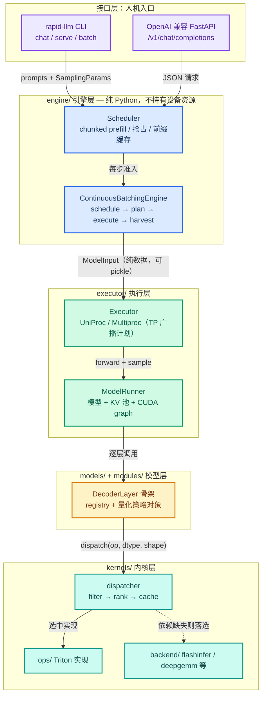

# rapid_llm 源码导读：从一次 HTTP 请求到一个 Triton kernel

rapid_llm 是一个基于 Triton 内核的轻量级 LLM 推理框架。本文按「架构 → 目录 → 数学表达 → 流程 → 测量」的顺序拆解它的实现：每个结论给出代码坐标，每条命令都能直接复制运行，每个公式都映射到框架配置参数。对应的其他专题文档：[连续批处理](continuous_batching.md)、[量化](quantization.md)、[张量并行](tensor_parallel.md)、[数据并行](data_parallel.md)、[在线服务](online_serving.md)、[评测](eval_models.md)。

## 目录

- [lite\_llama 源码导读：从一次 HTTP 请求到一个 Triton kernel](#rapid_llm-源码导读从一次-http-请求到一个-triton-kernel)
  - [目录](#目录)
  - [一、项目定位与快速上手](#一项目定位与快速上手)
    - [1.1 它是什么，不是什么](#11-它是什么不是什么)
    - [1.2 五分钟跑通：从安装到第一条生成](#12-五分钟跑通从安装到第一条生成)
  - [二、总体架构：五层单向依赖](#二总体架构五层单向依赖)
  - [三、目录与文件逐一解析](#三目录与文件逐一解析)
    - [3.1 engine/ 引擎层](#31-engine-引擎层)
    - [3.2 executor/ 执行层](#32-executor-执行层)
    - [3.3 kernels/ 内核层](#33-kernels-内核层)
    - [3.4 models/ 与 modules/ 模型层](#34-models-与-modules-模型层)
    - [3.5 其余支撑包](#35-其余支撑包)
  - [四、机制的数学表达](#四机制的数学表达)
    - [4.1 词表并行采样：每行两个标量](#41-词表并行采样每行两个标量)
    - [4.2 KV cache 容量预算](#42-kv-cache-容量预算)
    - [4.3 decode 内核的 roofline 检查](#43-decode-内核的-roofline-检查)
  - [五、初始化流程（端到端）](#五初始化流程端到端)
  - [六、推理流程](#六推理流程)
    - [6.1 一次性批处理（`LLM.generate`，离线）](#61-一次性批处理llmgenerate离线)
    - [6.2 连续批处理（`ContinuousBatchingEngine`，在线，核心路径）](#62-连续批处理continuousbatchingengine在线核心路径)
    - [6.3 三种 KV 布局的取舍](#63-三种-kv-布局的取舍)
  - [七、基准测试体系](#七基准测试体系)
    - [7.1 两层测量口径](#71-两层测量口径)
    - [7.2 怎么跑](#72-怎么跑)
    - [7.3 测量纪律](#73-测量纪律)
  - [八、设计方法汇总](#八设计方法汇总)
  - [九、特性概览和边界](#九特性概览和边界)
  - [参考资料](#参考资料)

## 一、项目定位与快速上手

### 1.1 它是什么，不是什么

rapid_llm 是一个**基于 Triton 内核的轻量级 LLM 推理框架**（见 [pyproject.toml](../pyproject.toml)），支持 LLaMA3 / Qwen2.5 / Qwen3 / Qwen3-MoE / LLaVA-1.5 / Qwen3-VL，要求 Python 3.13+，运行依赖只有 torch、triton、transformers、safetensors 四项。文件与类命名对齐 vLLM（`model_runner.py` ↔ `v1/worker/gpu_model_runner.py`、`continuous_engine.py` + `scheduler.py` ↔ `v1/engine/` + `v1/core/sched/`、`entrypoints/` ↔ `entrypoints/openai/`），量化子包的文件布局对齐 sglang，两个项目的代码可以对照阅读。整个框架约 2.3 万行 Python，从 HTTP 请求到 Triton kernel 是同一条代码路径：没有为多进程重写一份逻辑，也没有按运行模式切换的隐藏分支。

它不是训练框架，也不是内核研究框架，而是把「服务一个 LLaMA 结构的模型」这条路径走完整：调度、分页 KV、量化、多卡、可观测。一个推理框架该有的组件它都有，每个组件的体量也小到可以通读。

### 1.2 五分钟跑通：从安装到第一条生成

```bash
# 1. 安装：运行依赖只有 torch / triton / transformers / safetensors
uv pip install -e .

# 2. 权重即用即下：与 modelscope 落盘的目录结构一致，没有转换步骤
modelscope download Qwen/Qwen2.5-0.5B --local-dir my_weight/Qwen2.5-0.5B

# 3a. 交互 REPL（chat 默认 eager，原因见本节末尾）
rapid-llm chat --model-dir my_weight/Qwen2.5-0.5B

# 3b. OpenAI 兼容服务：/v1/models、/v1/completions、/v1/chat/completions（SSE 流式）
rapid-llm serve --model-dir my_weight/Qwen2.5-0.5B
```

离线批处理走 [examples/basic.py](../examples/basic.py)，这是最小的冒烟测试：

```python
from rapid_llm import LLM, SamplingParams

sampling_params = SamplingParams(temperature=0.0, top_p=1.0, max_gen_len=64)
llm = LLM(model="my_weight/Qwen2.5-0.5B")
outputs = llm.generate(prompts, sampling_params)   # -> list[RequestOutput]
```

每个 `RequestOutput` 打印 prompt、生成文本和 `finish_reason`（`length` / `eos` / `repeat`），逐条对应输入的 prompt。

CLI 的默认参数来自 `rapid_llm/cli.py` 的 `COMMON_OPTIONS`：temperature 0.6、top-p 0.9、repetition_penalty 1.1。取值依据是：小参数 base 模型在 fp16 argmax 平局（约 0.02 logit gap）下容易滑入重复死循环，1.1 的轻量惩罚是更安全的出厂行为，传 1.0 可显式关闭。CUDA graph 的缺省值按命令区分：`batch` / `serve` 吞吐场景默认捕获，`chat` / `vl-chat` REPL 默认 eager，因为单轮对话只有一步在飞，摊不平捕获延迟。

**小结**：运行依赖四项、无权重转换步骤、一条命令进 REPL 或服务。入口只有两个引擎（1.2 的 `LLM` 与 `rapid-llm` CLI）。

## 二、总体架构：五层单向依赖

```text
CLI (cli.py)  ─┐
API Server ────┤  接口层
               ▼
engine/        引擎层: 两种批处理策略 + 异步前端 + DP 路由（纯 Python，不持有设备资源）
               ▼
executor/      执行层: ModelInput（计划即数据）→ Executor → ModelWorker → ModelRunner
               ▼
models/ + modules/   模型层: registry + 骨架复用 + 量化方法策略
               ▼
kernels/       内核层: ops（实现）/ dispatcher（选择策略）/ backend（外部库适配）
               ▼
distributed/ platform/   基础设施: dp×tp 进程组、硬件探测
```



**计划即数据**：`ContinuousBatchingEngine` 把每一步要执行的工作描述成一个纯数据的 [ModelInput](../rapid_llm/executor/worker.py)，字段全是 int 元组加冻结的 `SamplingParams`，整体可 pickle，再交给 [Executor](../rapid_llm/executor/executor.py) 执行，拿回采样出的 token。这个设计带来三个直接结果：

1. **引擎层不持有设备状态**：引擎只操作 Python 数据结构，不持有任何 GPU 资源句柄；请求加入或结束时，不需要释放或失效任何设备侧对象。
2. **TP 只有一条代码路径**：rank 0 计算一次计划，经 gloo 广播（pickle 对象，几百字节），所有 rank 执行同一份 `ModelWorker.execute`。早期方案是各 rank 从广播的 prompt 各自推导 batch，任何一处推导分歧都会让 NCCL 集合通信形状不一致而挂死，而且难以排查。现在决策只做一次、原样分发，分歧在结构上不可能发生。
3. **布局靠推导，不靠传输**：position ids、KV 网格宽度、CUDA graph 的 padding、采样参数行，都由各 rank 从 `(slots, seq_starts, seq_lens)` 按相同规则在本地推导。控制面流量因此恒定，不随 batch 大小或序列长度增长。

依赖方向必须单向。反例：如果 kernels/ 反过来 import 了 executor/ 的张量布局约定，内核微基准就必须先构造整个 ModelRunner 才能测一个算子，「只测操作本身」的测量纪律（第 7.3 节）直接做不成。同理，dispatcher/ 模块 import 不触发 torch 加载，注册表才能在秒级完成冷启动；engine/ 不持有设备资源，请求进出才不需要失效任何设备侧对象。每一层的独立性，都在为上一层的可测试性买单。

**小结**：五层、单向依赖、一个核心抽象（计划即数据）。它换来的是单代码路径的 TP、恒定的控制面流量和可以脱离框架测量的内核。

## 三、目录与文件逐一解析

### 3.1 engine/ 引擎层

| 文件 | 作用 |
|------|------|
| [llm.py](../rapid_llm/engine/llm.py) | vLLM 风格门面 `LLM`（继承 LLMEngine）：prompt 规范化、多模态准备、`RequestOutput` 打包。限制：`data_parallel_size` 必须为 1，也不允许由它发起 TP 组。它的同步循环无法给 TP follower 派发计划，所以这两种配置直接报错，而不是静默退回单卡 |
| [llm_engine.py](../rapid_llm/engine/llm_engine.py) | **一次性批处理引擎**：`_DecodeSession` 持有每次调用的 token grid `[batch, total_len]`、KV 预留空间和设备端停止状态；`run()` 驱动 prefill→decode 循环。流式模式每步 yield 文本增量，非流式每 `POLL_INTERVAL=8` 步才读回一次 |
| [continuous_engine.py](../rapid_llm/engine/continuous_engine.py) | **连续批处理引擎**（在线服务的主引擎）：`step()` 固定为 schedule → plan → execute → harvest 四段；一步内可同时包含 PREFILL / EXTEND / DECODE 三种 pass |
| [scheduler.py](../rapid_llm/engine/scheduler.py) | 调度器：按到达顺序准入 + chunked prefill（`max_chunk_size=512`，`DEFAULT_MAX_NUM_BATCHED_TOKENS=8192`、`DEFAULT_MAX_NUM_SEQS=32` 见 scheduler.py:134）+ **提交式调度**（计划某个 chunk 时立即推进 `num_computed_tokens`，不等待执行回报）+ 可选抢占（重计算策略）+ prefix cache 准入 |
| [sampler.py](../rapid_llm/engine/sampler.py) | 采样：temperature / top-p / repetition penalty；`BatchedSamplingParams` 把逐请求参数整理成 `[batch, 1]` 张量，整批一次采样。**词表并行采样**基于恒等式 `log_softmax(x)_i = x_i − logsumexp(x)`（4.1 节展开），每行只需在 rank 间交换 2 个标量（对比 vLLM 的 all-gather 整份 logits）；top-p 候选池取各 rank 局部 top-k 的并集，通信量为 `O(k·tp)`，与词表大小无关 |
| [stop_criteria.py](../rapid_llm/engine/stop_criteria.py) | 设备端停止判定：`StopCriteria` 用词表大小的 bool 查表代替 `torch.isin`，因此可以进入 CUDA graph；`load_stop_token_ids` 合并 tokenizer EOS 与 generation_config.json 的 eos 列表；另有文本级重复检测（数字归一化后匹配 128 字符尾窗） |
| [detokenizer.py](../rapid_llm/engine/detokenizer.py) | 增量解码：`prefix_offset` / `read_offset` 双偏移窗口，摊销成本 O(1)；处理 SentencePiece 的 `▁` 与跨 token 的 UTF-8 序列 |
| [async_engine.py](../rapid_llm/engine/async_engine.py) | asyncio 前端：引擎独占一个 worker 线程；协程只投递命令、经 `call_soon_threadsafe` 接收增量，不直接操作引擎。因此 worker 线程内部不需要加锁 |
| [data_parallel.py](../rapid_llm/engine/data_parallel.py) | DP 协调器：N 个整模型副本进程，每个副本的 worker 常驻一个 ContinuousBatchingEngine，从队列领取请求；副本之间没有 NCCL 通信 |
| [dp_load_balancer.py](../rapid_llm/engine/dp_load_balancer.py) | 纯策略对象：round_robin / total_requests / total_tokens / cache_aware。`needs_token_estimate` / `needs_token_ids` 两个标志声明各策略的输入需求，router 只为被实际用到的字段做 tokenize |
| [async_data_parallel.py](../rapid_llm/engine/async_data_parallel.py) | DP 的 asyncio 前端：pump 线程把 mp.Queue 的消息调度回创建它的 event loop；消费者断开连接时 abort 对应请求，释放其 KV |
| [prefix_cache.py](../rapid_llm/engine/prefix_cache.py) | 块哈希链式前缀缓存（结构对标 vLLM BlockPool）：blake2b 哈希保证跨进程结果一致（DP router 与各副本因此能算出相同的块标识）；引用计数 + LRU，引用归零的块仍驻留供后续命中；容量上限防止缓存无限增长 |
| [multimodal.py](../rapid_llm/engine/multimodal.py) | 多模态准备接口：`MultimodalPreparer` 调用 HF processor、套用 Qwen3-VL chat template，并复用 HF 参考实现计算 mrope 的 3D position ids |
| [outputs.py](../rapid_llm/engine/outputs.py) | `RequestOutput` / `CompletionOutput`，结构对应 vLLM 的 outputs.py |
| [generator.py](../rapid_llm/engine/generator.py) | `TextGenerator` / `VisionGenerator` 兼容壳，全部委托给 `LLM` |

### 3.2 executor/ 执行层

| 文件 | 作用 |
|------|------|
| [worker.py](../rapid_llm/executor/worker.py) | 工作单元是 **forward + sample**：词表并行下采样本身是集合操作，必须在所有 rank 上执行，不能留在 rank 0 单独做。`ModelWorker` 从计划推导布局，经 `_forward_grid` / `_forward_extend` / `_forward_decode` 三条路径前向，批量采样后把 token 写入 `[num_slots, max_seq_len]` 生成网格（重复惩罚从该网格读取历史） |
| [executor.py](../rapid_llm/executor/executor.py) | `UniProcExecutor`（单进程）/ `MultiprocExecutor`（先广播计划，各进程执行本地份额）。`launch_tensor_parallel` 用 spawn 启动 follower 进程，选随机空闲端口做 rendezvous，阻塞到所有 rank 完成组初始化后才返回，保证随后分片层读到的并行宽度正确；`ensure_followers_alive` 在集合通信前检查进程存活，把进程死亡变成显式报错而不是集合通信互等挂死 |
| [model_runner.py](../rapid_llm/executor/model_runner.py) | 持有模型、KV cache 和逐步 forward；`build()` 串联 config → registry → loader。**TP 下的 CUDA graph 双重安全门**（`enable_cuda_graph`）：① 各 rank 的网格指纹一致（tensor_model_parallel_ranks_agree）；② graph 与 eager 输出的数值误差 ≤ atol。任一条件不满足，所有 rank 一起弃用图，不会出现部分 rank 走图、其余走 eager，然后在集合通信里互等。`forward()` 仅在 `seq_len == 1` 且无视觉输入时尝试 replay |
| [kv_cache_manager.py](../rapid_llm/executor/kv_cache_manager.py) | 分页 KV 池（块索引分配 + 引用计数）。`MemoryProfiler` 用一次 dummy forward 测峰值激活显存，剩余预算除以每 token KV 字节数得到块数（公式见 4.2 节）；TP 下对结论做 `tensor_model_parallel_all_reduce_min`，保证各 rank 容量一致 |
| [slot_batch.py](../rapid_llm/executor/slot_batch.py) | 连续批处理专用 KV 视图（`SlotBatch`）：**固定槽位**，槽 s 永久占用行 `[s·max_seq_len, (s+1)·max_seq_len)`，槽位表即恒等映射，省去每步的分配器搜索和设备同步；**组合稳定元数据**，运行集不变时，元数据只在设备端增长长度，不重建 |
| [attention_metadata.py](../rapid_llm/executor/attention_metadata.py) | 单个 dataclass，向每层 attention 传递：kv_buffer、cur_select_index、b_req_tokens_table、b_seq_len、is_prefill。`is_prefill` 是显式字段，不从序列长度推断，否则长度为 1 的 prompt 会被误判进 decode 路径 |
| [cuda_graph.py](../rapid_llm/executor/cuda_graph.py) | 图捕获与重放：每个 `(batch_size, seq_len_bucket)` 组合一张图（桶取自 `DEFAULT_BATCH_SIZES` × `DEFAULT_SEQ_LEN_BUCKETS`）；输入经持久缓冲 `copy_` 原地写入；捕获前先跑一次集合通信预热（NCCL 不能在图捕获期间初始化）；每图按约 64MB 预留 workspace 预算 |
| loader.py / weight_utils.py | 加载策略与文件读取分离（对应 vLLM 的同一拆分）：DefaultModelLoader 在 meta 设备上建参数，再流式物化；weight_utils 按需读取 safetensors 分片（30B 级权重不整份载入内存）。block-FP8 权重可选在目标设备上反量化（比 CPU 快约 30 倍），或以 uint8 原样透传 |
| [overlap.py](../rapid_llm/executor/overlap.py) | L1 算子级重叠：copy stream + pinned 暂存环 + CUDA event，把下一步 token / position 的上传与当前 forward 重叠。`RAPID_LLM_OVERLAP` 为总开关，附带 timeline 证据采集 |

### 3.3 kernels/ 内核层

```text
ops/        "算什么"   每个算子域一个目录: 实现 + 把自己和外部对手注册进 registry 的数据行
dispatcher/ "跑哪一个" torch-free 的 spec/registry/dispatch/autotune
backend/    "外部库"   flashinfer / deepgemm / flashmla / deepep, 每包含 INSTALL + 探针 + 适配器
```

- **dispatcher**：声明式 [KernelSpec](../rapid_llm/kernels/dispatcher/spec.py)，硬件窗口、dtype、scheme、shape 约束、layout 标签、golden 精度门，全部是纯数据。模块 import 不触发 torch 加载，注册表可在秒级完成冷启动。[dispatch()](../rapid_llm/kernels/dispatcher/dispatch.py) 固定四步：**过滤**（每次拒绝都记录原因，dtype/scheme/shape/layout/golden 各有专属理由行）→ **排序**（`_rank_key`（dispatch.py:250）：冻结的实测耗时 > shape 偏好 > 静态优先级，最后按 spec 名 tie-break，保证结果确定）→ **缓存** → **报告**（`explain()` 输出人类可读的决策链：谁落选、谁次优、赢家排名；设 `RAPID_LLM_KERNEL_TRACE=1` 后，每次决策输出一行 JSON）。环境变量可以按算子粒度强制指定后端，例如 `RAPID_LLM_ATTENTION_DECODE_BACKEND`。
- **probe**：探测外部库时直接尝试 import，而不做 `find_spec` 式的存在性检查：对编译扩展来说，文件存在不等于能加载。缺库属于**排序事件**而非崩溃：对应候选行落选，explain 说明原因，native Triton 实现保底可用。
- **autotune**：离线搜索最优 tile 配置，结果持久化到 `~/.cache/rapid_llm/autotune/`，启动时自动加载，未命中回退启发式。
- **ops 明细**：[flashattention2_nopad.py](../rapid_llm/kernels/ops/attention/flashattention2_nopad.py)（变长 no-pad prefill，用 exp2 并把 log2e 折入 scale）、[flashdecoding.py](../rapid_llm/kernels/ops/attention/flashdecoding.py)（分区分治 + log-sum-exp 合并，支持 fp8 e4m3 KV）、fused_moe.py（分组 GEMM，fp16/fp8/int8，含 `moe_align_block_size`）、quantization/（w8a16 位技巧反量化、w8a8 SmoothQuant、w4a16 AWQ/GPTQ、nvfp4）、skip_rmsnorm（残差 + RMSNorm 融合）、rope_emb（原位旋转，支持从融合 QKV 缓冲按列切片）、vocab_embedding（7 个 eager kernel 合并为 1 个）、swiglu（直接读 `[.., 2n]` 的合并 GEMM 输出，不产生临时张量）、kvcache/（update_kv_buffer / update_kv_index）。
- **backend 明细**：flashinfer（prefill/decode attention、rmsnorm、rope、sample 四个适配器，把框架的 plan/run 模型折回其原生签名）、deepgemm（Hopper fp8 dense 与 grouped GEMM，声明 NT layout 标签并缓存转置结果）、flashmla（MLA decode 的实现，通过 `kv:mla_latent` 布局标签声明 latent cache，从结构上排除与 per-head KV 池的误配）、deepep（expert-parallel all-to-all 的占位；当前仓库内 MoE 走 TP 而非 EP，暂无可用行属预期状态）。

### 3.4 models/ 与 modules/ 模型层

- [registry.py](../rapid_llm/models/registry.py)：`model_type → ModelSpec(实现类路径, is_multimodal)` 的唯一注册表，实现类懒加载。新增模型 = 一条注册项 + 一个实现文件。
- [config.py](../rapid_llm/models/config.py)：不自行定义模型配置结构，直接复用 HF `AutoConfig`。背景：transformers 5.x 调整过 rope 参数的存放位置，曾导致 Qwen3-VL 的 mrope 静默失效；跟随官方结构可减少这类问题。另负责归一化 KV cache dtype（fp8 存放在 uint8 容器中）。
- [base.py](../rapid_llm/models/base.py)：LLaMA / Qwen2 / Qwen3 之间的差异只体现在几个类属性上：qkv_bias、use_qk_norm、rotary_class、_build_mlp。其余行为（fused-QKV、per-head qk-norm、RoPE、KV 写入、prefill/decode 分支、SwiGLU、pre-norm 残差、forward 骨架）都在 `DecoderLayer` / `CausalLM` 中实现一次。
- [weights.py](../rapid_llm/models/weights.py)：处理三种结构差异的键名翻译：**fused QKV**（q/k/v 三矩阵拼接为单个 GEMM）、**fused gate/up**、**stacked MoE experts**（3×E 个矩阵打包为 3 个张量）。「重命名」是纯函数，产出参数名与 shard id；「放置」由层自带的 `weight_loader` 完成，了解头数与 TP 分片规则。两者分离，最后校验每个参数恰好被写入一次。
- 具体模型：[llama.py](../rapid_llm/models/llama.py)（与基类仅约 2 行差异）/ qwen2（qkv 带 bias）/ qwen3（加 qk norm，head_dim 与 hidden 解耦）/ qwen3_moe（按 `decoder_sparse_step` 决定哪些层换用 SparseMoeBlock）/ llava.py（CLIP tower + 2 层 MLP projector + LlamaModel）/ qwen3_vl.py（SigLIP tower + mrope 3D 位置 + DeepStack 视觉特征注入前几层隐藏态）/ mla_single_layer.py（flashmla 后端的参考输出验证载体，不注册进 registry）。
- **modules**（跨架构复用的层）：[linear.py](../rapid_llm/modules/linear.py)（Column / Row / QKVParallelLinear：GQA 下 q 与 kv 按各自头数分段切分，每个参数绑定自己的 `weight_loader`）；vocab_parallel（词表切分：embedding 做 gather + all_reduce，LM head 不做 gather，采样留在词表并行路径完成）；attention.py（`PagedAttention` 负责 KV 写入、fp8 量化、prefill/decode 分派；后端在构造时一次性选定并存为普通属性，热路径没有分发开销）；mlp.py（gate/up 共享一个 column-parallel GEMM）；moe.py（路由顺序与 HF 一致：全专家 fp32 softmax → top-k → renormalize，专家计算走分组 GEMM）；rotary_embedding.py（频率变体注册表，含 LLaMA-3 / YaRN 的重标定）；**quantization/**（文件布局对齐 sglang：QuantizationConfig 注册表 + LinearMethodBase / FusedMoEMethodBase 策略接口 + RawParameter（阻止 loader 把量化参数统一转成 fp16）+ AWQ/GPTQ checkpoint 布局归一化适配器）。

### 3.5 其余支撑包

- **distributed/parallel_state.py**：`dp × tp` 网格，`global_rank = dp_rank·tp_size + tp_rank`，使同一副本内的 TP rank 编号连续。每个副本有两组进程：NCCL 数据面（激活 / logits）与 gloo 控制面（广播 Python 对象）。单进程时所有集合操作为空操作，单卡路径不引入任何分支。
- **platform/**：PlatformInfo / CapabilityRequirement，不依赖 torch，注册表可以在 CPU-only 机器上于 import 期完成过滤；CudaPlatform 探测 sm75–sm100，接口为后续支持 ROCm 预留。
- **entrypoints/**：OpenAI 兼容 FastAPI（`/v1/models`、`/v1/completions`、`/v1/chat/completions` 流式 SSE、`/health`）。这一层保持薄：只做 JSON→SamplingParams 转换、chat template 和 SSE 帧封装；不支持的参数直接报错（例如请求 `n=4` 会返回错误，而不是静默只生成 1 条）。
- **tools/**：observability/collective_stats.py 提供集合通信台账，每次集合操作上报字节数，按数据面 / 控制面分别记账，统计窗口基于 contextvar，可嵌套。借助它，「词表并行采样每步只传 2·batch 个标量」是一个可实测验证的结论而非设计声明。profiling/ 提供不依赖 GPU 的静态显存预算和模型结构树渲染。
- **utils/**：prompt_templates 是模板处理的唯一入口，instruct 模型套用 tokenizer 自带的 chat_template，base 模型直传；CLI / serve / batch 共享同一个 `PrompterResolver`，避免多处维护各自一套的模板规则。另有 logger（彩色短级别名）、path_utils、image_process（LLaVA 图像处理）。

## 四、机制的数学表达

三个机制各配一个公式：采样的通信量、KV 的容量、decode 内核的物理上限。变量一律映射到 config.json 键名或代码变量。

### 4.1 词表并行采样：每行两个标量

TP 下 LM head 按词表切分（3.4 节 vocab_parallel），每个 rank 只持有自己那一段 logits。采样需要全词表归一化，朴素做法是把整份 logits all-gather 起来。框架用的是另一条路：归一化项是**每行一个标量**。

$$\log\mathrm{softmax}(x)_i \;=\; x_i - \log\sum_{j=1}^{V} e^{x_j} \;=\; x_i - \mathrm{logsumexp}(x)$$

其中：

- $x$：温度缩放后的本地 logits，`scaled = local_logits.float() / temperature`，形状 $[B, V/tp]$（[sampler.py](../rapid_llm/engine/sampler.py):310）；
- $B$：batch 内序列数；
- $V$：词表大小，对应 config.json 的 `vocab_size`（Qwen2.5 系列为 151936）；
- $tp$：`tensor_parallel_size`。

数值稳定实现（`vocab_logsumexp`，sampler.py:266）先做最大值平移再求和：

$$\mathrm{logsumexp}(x) \;=\; m + \log\sum_{j} e^{x_j - m}, \qquad m = \max_j x_j$$

平移量 $m$ 是全局性质，防溢出必须用**所有 rank 切片**的最大值，所以恰好两次集合通信：`tensor_model_parallel_all_reduce_max` 传 $[B,1]$，`tensor_model_parallel_all_reduce` 传 $[B,1]$（sampler.py:283-285），合计**每行 2 个标量**。通信量对比：

| 方案 | 每步采样通信量 | 与词表的关系 |
|------|--------------|------------|
| all-gather 整份 logits（vLLM 做法） | $B \cdot V \cdot s$ 字节 | 线性于词表 |
| 两标量归一化（本框架） | $2 \cdot B \cdot s$ 字节 | 与词表无关 |

其中 $s$ 是标量字节数（fp32 为 4）。以 Qwen2.5-0.5B（$V \approx 15.2$ 万）、$B=8$ 计：all-gather 约 4.9 MB，两标量方案 64 B，差 $V/2 \approx 7.6$ 万倍。这个结论可以用 `tools/observability/collective_stats.py` 的集合通信台账实测复现，而不是设计声明。

top-p 的候选池同样与词表无关：每个 rank 取本地 top-$k$，再做 all-gather。全局 top-$k$ 必然落在这个并集里，理由是一个进入全局 top-$k$ 的 token，在全局至多有 $k-1$ 个 token 排在它前面，因此在它自己的 rank 上也至多 $k-1$ 个，必进本地 top-$k$。通信量 $O(B \cdot k \cdot tp)$，对应 sampler.py 的 nucleus 采样分支（sampler.py:294）。

### 4.2 KV cache 容量预算

框架不为 KV 池写死容量，而是启动时用一次 dummy forward 量出来（`MemoryProfiler.available_kv_blocks`，[kv_cache_manager.py](../rapid_llm/executor/kv_cache_manager.py):93）：

$$N_{\text{token}} = \left\lfloor \frac{M_{\text{total}} \cdot u - M_{\text{peak}} - M_{\text{reserved}}}{b_{\text{kv}}} \right\rfloor$$

$$b_{\text{kv}} = 2 \cdot n_{\text{layer}} \cdot n_{\text{kv\_head}} \cdot d_{\text{head}} \cdot s_{\text{dtype}}$$

其中：

- $M_{\text{total}}$：`torch.cuda.mem_get_info()` 报告的 GPU 总显存；
- $u$：`gpu_memory_utilization`；
- $M_{\text{peak}}$：dummy forward 后 `allocated_bytes.all.peak` 的峰值激活，外加缓存分配器之外的非 torch 占用（`non_torch`，kv_cache_manager.py:112-117）；
- $M_{\text{reserved}}$：CUDA graph workspace 预留（每图约 64 MB，启用时先行扣除）；
- $n_{\text{layer}}$：config.json 的 `num_hidden_layers`；
- $n_{\text{kv\_head}}$：`num_key_value_heads`（GQA 下远小于 query 头数）；
- $d_{\text{head}}$：`head_dim`；
- $s_{\text{dtype}}$：fp16 为 2 字节；`--kv-cache-dtype fp8` 时 e4m3 字节存放在 uint8 容器中，为 1 字节；
- 因子 2：K 与 V 各存一份。

代入 Qwen2.5-0.5B（24 层 × 2 KV 头 × head_dim 64，fp16）：$b_{\text{kv}} = 2 \times 24 \times 2 \times 64 \times 2 = 12{,}288$ B ≈ 12 KiB/token。换 fp8 KV 后 $b_{\text{kv}}$ 减半到 6 KiB，同样显存能装的 token 数翻倍：A10 实测 282K 对 148K tokens（1.91×），吞吐代价 9%（[kv_cache_fp8_v06.json](benchmark_logs/quantization/kv_cache_fp8_v06.json)）。TP 下对这个结论做 `tensor_model_parallel_all_reduce_min`，各 rank 容量一致，「所有 rank 结论一致」由机制保证。

### 4.3 decode 内核的 roofline 检查

decode attention 读整个 KV 历史、算两次 matmul，是典型的带宽受限算子。微基准给每个算子声明**理论代价**（`Work(flops, moved)`，[microbench.py](../benchmarks/kernels/microbench.py):102），再与实测时间对比，得到资源利用率。以 [bench_paged_decode.py](../benchmarks/kernels/bench_paged_decode.py):51 的 `decode_work` 为例：

$$\text{FLOPs} = 4 \cdot n_q \cdot d_{\text{head}} \cdot N_{\text{cached}}$$

（$q@k$ 与 $p@v$ 两次 matmul，每个被注意的 token 每个 query 头各计 $2 \cdot d_{\text{head}}$ FLOPs；$n_q$ 为 `num_attention_heads`，$N_{\text{cached}}$ 为该步注意到的缓存 token 总数。）

$$\text{bytes} = N_{\text{cached}} \cdot 2 \cdot n_{kv} \cdot d_{\text{head}} \cdot s + 2 \cdot B \cdot n_q \cdot d_{\text{head}} \cdot s$$

（第一项是缓存里的 K/V 各读一次；第二项是 q 进、out 出。这是**下界**：内核自己的 split-K 部分缓冲、重复加载都不计入，否则一个缓存踩踏的实现反而会拿到更高的 GB/s，指标随实现变差而变好。）

算术强度 $I = \text{FLOPs}/\text{bytes}$ 与机器平衡点 $r = \text{TFLOP/s} \div \text{GB/s}$ 比较：$I < r$ 即带宽受限。A10 的峰值为 125 TFLOP/s、600 GB/s（microbench.py:32；`device_peaks` 的带宽由显存时钟 × 位宽 × 2 推得），平衡点 $r \approx 208$ FLOP/byte，而 decode 的 $I$ 通常只有个位数。也就是说，优化方向是少读字节（fp8 KV），而不是省 FLOPs。

`report()` 打印每行的 %tc / %bw（相对张量核 / 带宽峰值的百分比），任何一行超过 100% 都按违规处理、不当作达标，按这个顺序排查（microbench.py:377）：单位因子、FLOP/字节公式、被内核跳过的功（掩码尾块、提前退出）、常驻 L2 没碰 HBM 的工作集、跑的不是同一操作的基线。7.3 节展开测量纪律。

**小结**：三个公式各管一件事：采样通信量决定 TP 扩展性（4.1），KV 预算决定并发上限（4.2），roofline 决定优化方向（4.3）。三条都能落到实测，分别有集合通信台账、启动日志（`KV-cache profiling: total=… peak=… -> N cache tokens`）和微基准的 %bw 列。

## 五、初始化流程（端到端）

以 `ContinuousBatchingEngine.from_pretrained(..., tensor_parallel_size=2)` 为例：

```text
1. read_model_type() 读 config.json → ModelRegistry.resolve() 得 ModelSpec（多模态在此拦截）
2. launch_tensor_parallel(tp=2):
   ├─ free_port() 取随机端口（避免固定 29500 撞车或残留连接导致挂死）
   ├─ spawn rank1 进程 → init_tensor_parallel(rank=0/1): gloo + NCCL rendezvous
   └─ 返回前整个组已建好 → 分片层读到的并行宽度必然正确
3. LLMEngine.__init__ → ModelRunner.build():
   ├─ ModelConfig.from_pretrained  (AutoConfig + KV dtype 归一化)
   ├─ DefaultModelLoader.load_model:
   │    懒 import 实现类 → 各层由量化方法 create_weights（meta 设备）
   │    → hf_weights_iterator 按需流式读 safetensors → weights.py 重命名 + 层的
   │      weight_loader 放置（含 TP 切片）→ materialise_parameters
   │      （RawParameter 保留原 dtype，其余转 fp16）
   └─ KV 预算: MemoryProfiler（dummy forward 测峰值激活，公式见 4.2 节）
        若启用 CUDA graph，先扣除每图约 64MB 的 workspace
        TP 下 tensor_model_parallel_all_reduce_min，各 rank 结论一致
        → KVCacheManager 分页池 + b_req_tokens_table
4. ModelRunner.enable_cuda_graph(): 捕获 (batch × seq_bucket) 图
   TP 下: 预热集合通信 → 网格指纹一致检查 → graph 与 eager 数值比对 →
          任一不通过则所有 rank 一律走 eager
5. enable_slot_kv_cache(): 槽位 KV 视图接管连续批处理路径
6. Scheduler(config, num_slots) — num_slots = min(池容量 / max_seq_len, max_num_seqs)
7. (TP > 1) MultiprocExecutor 包住 worker
```

LLMEngine 的构造器同时是 follower 的构造器：follower 在 [run_follower](../rapid_llm/executor/executor.py) 里执行完全相同的构建流程，然后进入 `serve_plans` 循环，收计划、执行、丢弃自己采样出的 token（只有 rank 0 负责 detokenize），直到收到 `None`。

## 六、推理流程

### 6.1 一次性批处理（`LLM.generate`，离线）

```text
generate() → _DecodeSession:
  free_all() 重置分页分配器 → token grid 一次性上卡 → prefill_alloc_kv_cache（连续分配）
  循环 cur_pos ∈ [max_prompt_len, total_len):
    forward(input_ids[:, prev:cur], positions,
            logits_positions=各序列最后一个真实 prompt 位置)   ← 在 lm_head 前 gather，
            每个序列只投影一行
    decode_alloc_kv_cache() → update_kv_index（必须先递增 b_seq_len 再写索引，
    顺序颠倒会覆写已有 KV）
    sampler.sample → TP 下 tensor_model_parallel_broadcast（各 rank 随机数生成器独立，采样结果必须同步）
    StopCriteria.update — 全在设备端，不产生同步
    每 POLL_INTERVAL=8 步执行一次 _flush 读回（这是唯一的 D2H；流式模式每步读回）
  释放全部 KV 引用
```

### 6.2 连续批处理（`ContinuousBatchingEngine`，在线，核心路径）

```text
add_request: tokenize → Scheduler.add_request（max_new_tokens 对 context 收口）→ WAITING
step():
  ① scheduler.schedule() — 三阶段提交式调度:
     S0 _promote_pending_owners（上一步计划的 prefix 块，此刻才允许被复制使用）
     S1 恢复在途 prefill 的下一个 chunk（按到达顺序，先于新请求，防止饿死）
     S2 准入: _admit — 网格成本按 chunk 计价，不按整个 prompt 计;
        无空闲槽且允许抢占 → 驱逐最近加入且已产出至少 1 个 token 的请求
        （重计算策略: 已生成 token 并入 prompt、max_new_tokens 相应缩减、
        进度配额防止活锁）;
        prefix cache 命中: 已缓存的 token 不重算; 同槽命中零拷贝，
        异槽命中生成 copy 指令
     S3 decode 批 = 已完成 prefill 的运行集
  ② 引擎把调度结果翻译成 _Work 列表:
     chunk 按"槽里是否已有该序列的 KV"分流 — 首块走 PREFILL 网格（纯 grid 内自注意力），
     续块必须走 EXTEND（逐 token 成行、读取全部历史，否则已算出的前缀被丢弃）
     + DECODE pass（输入 token 即上一步采样出、已在主机上的那个）
  ③ executor.execute(plan): copy_prefix → forward（graph replay 或 eager）→ sample_batched
  ④ _harvest（每步唯一的同步点）: 读回 token → 增量 detokenize → EOS / 长度 / 重复判定
     → 完成的请求在下一步立即释放槽位
```

### 6.3 三种 KV 布局的取舍

| | 一次性批处理 | 连续批处理 | 前缀缓存 |
|------|------------|-----------|---------|
| 数据结构 | 分页池，`block_size=1` 顺序分配 | 固定槽位：槽 s 占行 $[s \cdot L_{\max}, (s{+}1) \cdot L_{\max})$ | 块哈希链 + 引用计数 + LRU |
| 分配时机 | `generate()` 开始时一次分配（此时所有 prompt 长度已知） | 请求准入时拿槽，结束即释放 | 准入时按块哈希匹配 |
| 每步开销 | 0 | 0（槽位表即恒等映射，无分配器搜索、无设备同步） | 同槽命中零拷贝；异槽命中生成 copy 指令 |
| 代价 | 每次调用 `free_all()` 重置 | 槽按 `max_seq_len` 预留，并发数 ≤ 槽位数 | blake2b 哈希计算 + 容量上限管理 |
| 代码 | `KVCacheManager`（kv_cache_manager.py） | `SlotBatch`（slot_batch.py） | `PrefixCache`（prefix_cache.py） |

三个布局对应三种 workload 假设：一次性批处理知道全部序列长度，可以选最简单的布局；连续批处理的请求动态进出，用「槽位预留」换掉每步的分配与同步（代价写进了并发上限 `num_slots = min(池容量 / max_seq_len, max_num_seqs)`）；前缀缓存要跨请求复用，所以键必须是跨进程稳定的哈希。

**小结**：一次性批处理是 lockstep 网格、每 8 步一次 D2H；连续批处理每步恰好 1 次同步（harvest），三种 pass 可在同一步混合。KV 布局随 workload 假设切换，三者共用同一个分页池的物理缓冲。

## 七、基准测试体系

结论要有出处。基准测试分三层：共享库 `rapid_llm/benchmark/`（指标口径、被测系统适配、数据集、落盘与打印，与引擎同包，对标 sglang 的 `python/sglang/benchmark/` 和 vLLM 的 `vllm/benchmarks/`），场景层 `benchmarks/bench_*.py` 测用户看得见的指标（TTFT / TPOT / 吞吐），kernel 层测单个算子对硬件上限的逼近程度。三层共用一条纪律：**先证明算得对，再谈快**。库里每个引擎只有一份驱动实现（`Backend.measure_rows`），场景脚本与 runnable 都走它——否则两条路径会在 warm-up、取哪一轮、`greedy` 含义上悄悄分叉，测出来的数就不再可比。

### 7.1 两层测量口径

e2e 层（口径定义在 [rapid_llm/benchmark/](../rapid_llm/benchmark/)，对齐 vLLM/TensorRT-LLM）：

- **TTFT**（首 token 延迟）：prefill 提交到第一个 token 可见的墙钟时间。LiteBackend 靠 stream 每步回调直接打点；HF transformers 的 `generate()` 没有逐步回调，HFBackend 用两段式拆：先跑 1 token 测 TTFT，再跑全程（benchmark/backends.py）。
- **TPOT**（每 token 生成延迟）：稳态每步延迟，取首 token 之后所有步间隔的均值；batch 内 lockstep 推进，`gen_tokens = steps × batch`。
- **TPS**：`gen_tokens / 总时间`。

在线服务另有专用口径（[`engine/run.py scheduler serving`](../benchmarks/engine/run.py)）：真实子进程 + 真实 socket + SSE，TTFT 报 mean 和 p99（负载下尾部才是用户感知到的数），TPOT 从请求自己的帧间隔取，在队列里等待的请求不会被重复计费。正确性三重校验（`batch` / `dup` / `offline`）全部在 temperature=0、采样字段显式钉死的条件下对比**前缀一致率**：greedy 解码是混沌的，一旦一个 token 分叉，逐位一致率必然衰减，只有前缀一致率才能反映真实偏差。

kernel 层（[microbench.py](../benchmarks/kernels/microbench.py)）：`Work` 声明理论代价，`Row` 派生 TFLOP/s 与 GB/s，`report()` 先打吞吐后打延迟（吞吐跨 shape 可比），每行附 SOL（speed-of-light，理论上限）检查；`metadata()` 输出设备 / 软件版本 / commit / 改变后端选择的环境变量，没有这一行的表格只是轶事。

### 7.2 怎么跑

```bash
# e2e：eager vs CUDA graph，--verify 断言 graph 不改变贪心输出
python -m rapid_llm.benchmark.one_batch --model my_weight/Qwen2.5-0.5B --verify

# 跨引擎对照（同一批 prompt、同一指标口径；--engine all 覆盖 rapid_llm/transformers/vllm）
python -m rapid_llm.benchmark.offline_throughput --model my_weight/Qwen2.5-0.5B --engine all

# 在线服务矩阵：量化 x TP x 并发，逐配置起独立服务进程
python benchmarks/engine/run.py scheduler serving --model-dir <ckpt> \
    --schemes fp16 fp8 int4 --tp 1 2 --concurrency 1 8 32

# 调度器特性矩阵：prefix-cache / chunked prefill × CUDA graph，另附
# diag-prefix（按 wave 分解 TTFT）与 diag-preempt（超订抢占一致性）子命令
python benchmarks/engine/run.py scheduler matrix --model-dir <ckpt> --graph --prefix-cache

# 全模型套件（结果 JSON 落 docs/benchmark_logs/）
python benchmarks/suites/run.py compare

# 内核微基准：先正确性门（max_abs_diff），再计时，最后 SOL 检查
python benchmarks/kernels/bench_paged_decode.py
python benchmarks/kernels/bench_kv_write.py
```

benchmarks/ 全部脚本的分工：

| 脚本 | 测什么 |
|------|--------|
| `python -m rapid_llm.benchmark.one_batch` | TTFT/TPOT/TPS 基线，eager vs CUDA graph，`--verify` 断言 graph 不改变贪心输出（跨引擎对比见 `offline_throughput --engine all`） |
| [`engine/run.py`](../benchmarks/engine/run.py) | 统一引擎级入口：`scheduler matrix/continuous/serving/diag-prefix/diag-preempt`、`optimizations` 特性 A/B、`quant` 量化矩阵、`cpu` forward 微基准 |
| [`suites/run.py`](../benchmarks/suites/run.py) | 统一批量套件入口：`compare` 跨引擎、`e2e` eager/graph、`models` modelzoo、`qk-norm run/summarize` |
| [bench_data_parallel.py](../benchmarks/parallelism/bench_data_parallel.py) | DP 三个实验：`--mode scaling` 吞吐扩展（weak/strong scaling，输出逐条 diff 防止速度掩盖错误）· `--mode prefix` 前缀缓存跨副本的命中率与路由质量 · `--mode graph` DP×CUDA graph 四格矩阵（TPOT、capture 代价、显存增量） |
| [overlap/levels.py](../benchmarks/overlap/levels.py) | 重叠原语基准入口：`--level l1/l2/l3`（copy-stream 上传 / 双批重叠 / 分块 all-reduce），附 timeline 证据 |
| [overlap/policies.py](../benchmarks/overlap/policies.py) | 重叠策略基准入口：`--policy sbo/ep_tbo/ep_matrix/prefill/scaling/matrix` |
| [bench_observability.py](../benchmarks/serving/bench_observability.py) | 每个可观测开关的每 token 开销一行 |
| [bench_mla.py](../benchmarks/models/bench_mla.py) | MLA KV 经济学：config 解析 KV 几何，同一 workload 量延迟与显存足迹 |
| [bench_parser.py](../benchmarks/serving/bench_parser.py) | 推理/工具解析器的每 token CPU 成本（流式增量口径） |
| [eval/](../benchmarks/eval/) | 按数据集组织的精度基准（sglang 布局）：gsm8k / boolq / hellaswag 各自 `bench_rapid_vllm.py`（引擎臂，CUDA graph 默认开）+ `bench_hf.py`（HF baseline）+ `common.py`（口径单点定义），实测数字见 [eval_models.md](eval_models.md)；DeepSeek 裁剪版逐层等价性套件已移至 `tests/layer/` |
| [lib/](lib/) | 共享库：workloads（工作负载）· metrics（TTFT/TPOT/TPS 口径）· backends（被测系统 ABC + 工厂）· utils（显存足迹、JSON 落盘、表格）· dp（DP 脚手架） |
| kernels/microbench.py | 微基准 harness：三种计时器 + 正确性门 + SOL 报告 |
| kernels/kv_pool.py | 分页 KV 池 fixture（7.3 节的四个属性） |
| kernels/bench_paged_decode.py / bench_kv_write.py / bench_flashinfer.py / bench_mla_decode.py / bench_fused_moe.py / bench_fused_mlp_silu.py / bench_quant_gemm.py / bench_softmax.py / bench_vocab_embedding.py / bench_dispatch.py | 各算子域的微基准，行名对齐 `KernelSpec.name` |
| [kernels/freeze_dispatch_ranking.py](kernels/freeze_dispatch_ranking.py) | 把实测排名冻结进 dispatch 的 perf provider（v0.9 起 dispatch 排序的第一键） |
| kernels/tuning.py | 量化内核 autotune 搜索的共享记录格式 |

### 7.3 测量纪律

这几条来自踩过的坑，每条都能对应到 harness 里的一个具体机制：

1. **正确性门在计时之前。** `verify()` 先 `assert_close` 再返回 `max_abs_diff`，因为一个跑得快的错误内核不是数据点。这个返回值正是 `GoldenRecord.max_abs_diff` 的来源：没有它的实现进不了默认 dispatch（dispatch.py:245 的 golden 过滤）。dtype 变体各测各的：fp8 在内核里走的是另一段代码，fp8 行借 fp16 兄弟验证等于没验证。
2. **只测操作本身。** 池构造、索引生成、`.contiguous()` 拷贝都留在计时区外；如果拷贝本身就是研究对象（见第 4 条），单独成行。
3. **选对计时器，数字差一个量级。**

   | 计时器 | 适用 | 量测方式 | 典型误用 |
   |--------|------|---------|---------|
   | `bench(fn)` | fn 幂等 | `do_bench`，中位数，L2 冲刷在计时事件之外 | 拿去测有状态调用，测到的永远是第一次调用后的状态 |
   | `bench_stateful(fn, reset)` | 每次调用改变状态（块分配、引用释放、逐出） | CUDA events，所有区间先入队后读回；reset 必须留在设备端 | reset 里混入 `.item()` → 隐式同步，地板回来了 |
   | `bench_host(fn, reset)` | 成本是 host 在等，不是 GPU 在算 | `perf_counter` + 尾部同步 | 用 CUDA event 计 host 阻塞：launch queue 停 250 µs、只发 3 µs kernel 的函数会显示 3 µs，近乎免费 |

   > 踩坑实录：同一 2 MiB 工作集，冷 L2 中位数 26.6 µs，warm-L2 但每迭代同步 100.5 µs。每迭代同步会把 Python 与 launch 开销拉进窗口，形成约 100 µs（A10）的地板。`AutotuneSearcher._benchmark`（[searcher.py](../rapid_llm/kernels/autotune/searcher.py):99）恰好是这个形状，所以它在 decode 尺度上不区分配置；比较 autotune 配置请用 harness。

4. **生产输入不重建。** KV 相关内核读的是分配器发出来的状态，`torch.randn` 造不出来。[kv_pool.py](kernels/kv_pool.py) 的 fixture 复现四个属性，每个属性都带着一条实测结论：碎片行表（值 2-4%，证明 paging 不是 decode 回归的藏身处）；组合 per-layer 缓冲 + strided K/V 视图（拆分分配变体四形状三平一负 8%，行保留作小几何 guard）；池 ≥ 8× L2（把工作集撑大到带宽受限而非 launch 受限）；fp8 走真量化器（e4m3 字节 + 调用方 scale，不是 cast）。绝不对生产输入做 `.contiguous()`，这个教训来自一次真实的测量事故；想测它就单独立行。
5. **prefill 与 decode 是一个内核上的两种操作，不是一条曲线上的两点。** KV scatter 在 prefill 是带宽 kernel（70-76% 峰值带宽）；到 decode 所有形状塌到 4-5 µs，进入 launch 受限区，%bw 已无意义；省钱的唯一方式是更少的 launch，而不是更少的字节。
6. **dtype 行读成独立瓶颈，不是 dtype 列。** fp8 KV 读侧流量减半但时间只降 6-10%（dequant 受限），%bw 从约 67% 跌到约 37%。按 dtype 变体读会觉得像回归，按瓶颈读才知道是换了一个限制。fp8 正确性对**同一批字节**经 torch 加宽后的结果验证（`view(torch.float8_e4m3fn).to(torch.float16)`），与 fp16 池对比会把反量化误差和 fp8 舍入混在一起。
7. **host 时间是 decode 路径上最大的数，而 CUDA event 看不见它。** `KVCacheManager.alloc_kvcache_index` 的 bump 快路径只要 24 µs，bump 游标失效后要 265-275 µs，差出一个 11× 的台阶。成本花在 `nonzero(...).item()` 上：一个结束的请求，会把这笔成本强加给之后每个 decode 步，而旁边的 scatter 只花 4 µs。测它要用 `bench_host`，并打一行 `bench_host(lambda: None)` 的地板作参照；进入每个状态要用公共 API，reset 要完整（`free_all()` 会恢复 bump 游标，只调它等于三条状态全测了快路径）；case 标签里写明状态（`bump` / `run_search` / `fragmented`），没有状态标签的分配器行不可复现。
8. **结果要能回灌 dispatch。** `set_perf_provider`（从 `rapid_llm.kernels.ops.dispatch` 导入，不从 `rapid_llm.kernels.ops` 再导出）安装冻结耗时表；provider 以毫秒计，harness 报微秒，`AutotuneSearcher` 持久化 `latency_us`（config_store.py）。同一个闭环里出现了三个单位，每个边界都要显式换算。行名用 `KernelSpec.name`（如 `native/flash_decoding`）并断言 `sel.spec.name == _IMPL`，否则表格写着一个内核、dispatch 跑着另一个。

**小结**：测量体系与 dispatch 构成闭环。微基准产出带 `max_abs_diff` 的实测行，冻结后成为 dispatch 排序的第一键，`explain()` 让每次选择可追责；这套纪律的直接产出，就是 docs/benchmark_logs/ 下按 `(GPU, 模型, batch, gen_len)` 归档的 JSON。

## 八、设计方法汇总

| 设计方法 | 具体体现 |
|----------|----------|
| **计划即数据** | ModelInput 纯数据、可 pickle，driver / follower 共用一条代码路径，避免多进程各自推导 batch 引发的 NCCL 挂死 |
| **同步点预算制** | 连续批处理每步恰好 1 次 D2H（harvest）；一次性批处理按 `POLL_INTERVAL=8` 摊销；停止判定全部在设备端完成 |
| **提交式调度** | 计划时即推进 `num_computed_tokens`，无执行回报协议；中断后可依据 Request 对象恢复状态 |
| **注册表 + 策略** | ModelRegistry、KernelSpec 注册表、量化 scheme 注册表、LoadBalancer、CliCommand（模板方法） |
| **Null Object** | `_NullPrefixCache`：`enable_prefix_cache=False`（默认）时替换 `PrefixCache`，准入路径因此没有分支判断 |
| **确定性优先** | dispatch 排序有最终 tie-break（spec 名）；TP 下 greedy 出现多个最大值时取 token id 最小者 |
| **用集合通信检查一致性** | TP CUDA graph 的指纹 / 数值比对双门、`tensor_model_parallel_all_reduce_min` 对齐 KV 容量。「所有 rank 结论一致」由机制保证，不靠约定 |
| **静默失败显式化** | 请求 `n=4` 直接报错而非只返回 1 条；`LLM` 拒绝自行组建 TP 组；`RAPID_LLM_TP_CUDA_GRAPH=0` 可关闭 TP CUDA graph 应急 |
| **双平面分离** | NCCL 承载数据、gloo 承载控制；集合通信台账按面分别记账 |
| **结论以测量为准** | 词表并行每行 2 标量有台账佐证、KV 容量有启动日志、内核有 SOL 检查与 golden 精度门（第四章与第七章） |

## 九、特性概览和边界

**特性概览**：

- **注意力**：FA2 no-pad prefill（支持 TMA autotune）、FlashDecoding 分页 decode（GQA、fp8 KV e4m3 + 反量化 scale）、PagedAttention（KV 写入 + fp8 量化入池 + prefill/decode 分派）。
- **调度**：continuous batching、chunked prefill（默认 512）、前缀缓存（块哈希链 + LRU）、重计算抢占、请求中止即释放资源。
- **并行**：TP（每层一次 all-reduce、GQA 下 QKV 按头数分段切分、词表并行采样每行 2 标量、带双重安全门的 TP CUDA graph）；DP（round_robin / total_requests / total_tokens / cache_aware，cache_aware 用块哈希做副本亲和）；二者可组合为 dp×tp 网格。
- **量化**：W8A16（fp8/int8）、W8A8（fp8 per-token 与 SmoothQuant int8）、W4A16（AWQ/GPTQ checkpoint 布局归一化）、NVFP4 weight-only、FP8 KV cache、fused MoE 三种精度；量化方法以策略对象接入，新增 scheme 不改动层代码。
- **系统**：decode CUDA graph（覆盖多模态与 TP 场景）、kernel autotune 持久化、后端注册表（探测 / 解释 / 缺库降级）、L1 copy-stream 重叠、集合通信台账、OpenAI 兼容服务（SSE 流式）、多模态（LLaVA / mrope / DeepStack）、MLA 验证载体（flashmla）。

**当前边界**：

- 连续批处理引擎**仅支持文本** checkpoint：视觉输入需要逐请求的 processor 输出，连续批处理的网格结构没有合适的位置承载；多模态请走 `LLM`，它的 decode 阶段同样可以 replay CUDA graph，因为此时视觉 token 已经以普通 KV 行的形式存在。
- `vl-chat` 命令行仅支持单卡：TP 只经连续批处理引擎提供，向 `vl-chat` 传 `tensor_parallel_size > 1` 会直接报错退出。
- fp8 KV cache 的 k_scale / v_scale 目前硬编码为 1.0（已在代码中验证）；量化 MoE 在极小 batch 下，`moe_align_block_size` 约 185µs 的固定开销占主导。
- MLA 尚无端到端模型：目前只有单层测试为 flashmla 后端积累参考输出；DeepEP 的 expert-parallel 支持与专家并行组规划在后续里程碑中。

## 参考资料

- [vLLM](https://github.com/vllm-project/vllm) — 文件命名与调度结构的对照源；词表并行采样的 all-gather 基线也出自这里
- [Efficient Memory Management for LLM Serving with PagedAttention (Kwon et al., 2023)](https://arxiv.org/abs/2309.06180) — 分页 KV 与 vLLM BlockPool 的原型
- [FlashAttention: Fast and Memory-Efficient Exact Attention with IO-Awareness (Dao et al., 2022)](https://arxiv.org/abs/2205.14135) — FA2 no-pad prefill 与 FlashDecoding 的分区分治 + LSE 合并来源
- [SGLang](https://github.com/sgl-project/sglang) — 量化子包文件布局的对照源
- [FlashInfer](https://github.com/flashinfer-ai/flashinfer) — backend/ 的注意力与采样外部后端
- [Triton](https://github.com/triton-lang/triton) — 全部自研内核的语言与 autotune 机制
- 本仓库专题文档：[连续批处理](continuous_batching.md)、[量化](quantization.md)、[张量并行](tensor_parallel.md)、[数据并行](data_parallel.md)、[在线服务](online_serving.md)、[基准模型清单](benchmark_models.md)
- 实测数据归档：[docs/benchmark_logs/](benchmark_logs/) — 按 GPU、模型、batch、gen_len 归档的 JSON 结果
